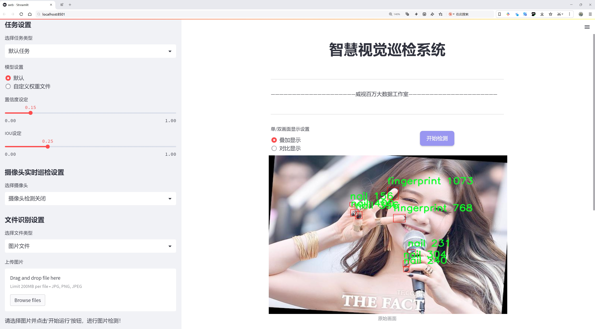
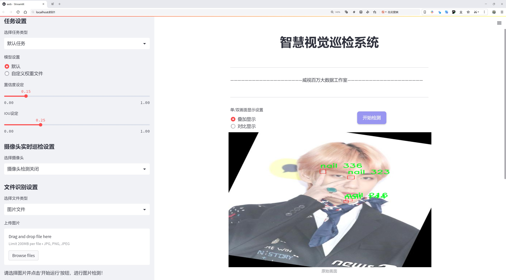
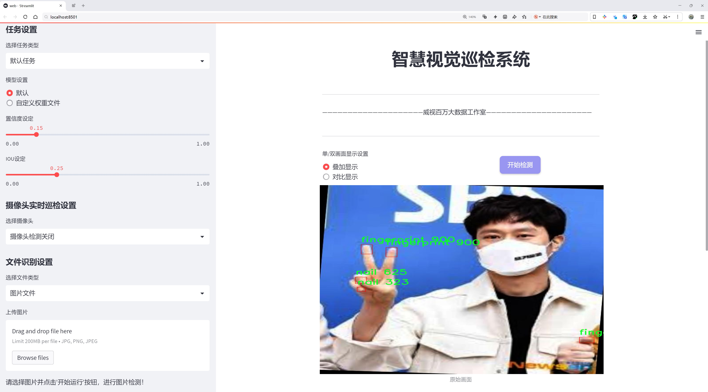
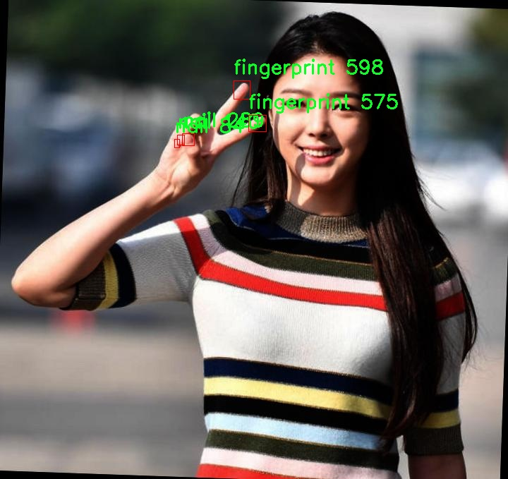
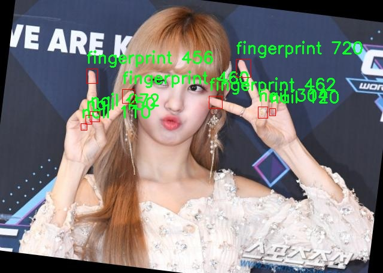

# 指纹与指甲检测检测系统源码分享
 # [一条龙教学YOLOV8标注好的数据集一键训练_70+全套改进创新点发刊_Web前端展示]

### 1.研究背景与意义

项目参考[AAAI Association for the Advancement of Artificial Intelligence](https://gitee.com/qunshansj/projects)

项目来源[AACV Association for the Advancement of Computer Vision](https://gitee.com/qunmasj/projects)

研究背景与意义

随着信息技术的迅猛发展，生物特征识别技术在安全、身份验证等领域的应用愈发广泛。指纹识别作为一种成熟的生物识别技术，因其独特性和稳定性被广泛应用于金融、公安、智能手机等多个领域。然而，传统的指纹识别系统往往面临环境干扰、图像质量不佳等问题，导致识别率下降。与此同时，指甲作为另一种生物特征，虽然在指纹识别中并不常被关注，但其独特的形态特征也为身份验证提供了新的可能性。因此，基于改进YOLOv8的指纹与指甲检测系统的研究具有重要的理论价值和实际意义。

本研究旨在通过构建一个高效的指纹与指甲检测系统，利用YOLOv8这一先进的目标检测模型，提升指纹和指甲的检测精度和速度。YOLOv8作为当前深度学习领域的一项重要进展，具备了实时检测和高准确率的优势，适合处理复杂的图像识别任务。通过对YOLOv8模型的改进，结合特定的数据集进行训练，我们希望能够有效提升指纹与指甲的检测性能，克服传统方法在多样性和复杂性方面的不足。

在数据集方面，本研究使用了包含6951张图像的FingerPrint数据集，涵盖了指纹和指甲两个类别。这一数据集的丰富性为模型的训练提供了坚实的基础，使得模型能够学习到指纹和指甲的多样性特征，进而提高其在实际应用中的适应性。通过对指纹和指甲的同时检测，不仅可以提高身份验证的准确性，还能在一定程度上增强系统的安全性。例如，在一些高安全性场合，结合指纹与指甲的双重验证，可以有效防止身份冒用和伪造。

此外，指纹与指甲的联合检测系统在智能家居、金融支付、公共安全等领域也展现出广阔的应用前景。随着物联网技术的发展，越来越多的设备开始采用生物识别技术进行身份验证。一个高效的指纹与指甲检测系统，能够为这些设备提供更为安全、便捷的身份识别解决方案，从而推动智能设备的普及和应用。

综上所述，基于改进YOLOv8的指纹与指甲检测系统的研究，不仅能够提升指纹和指甲的检测精度，推动生物识别技术的发展，还能为相关领域的应用提供新的思路和方法。这一研究将为未来的生物特征识别技术奠定基础，具有重要的学术价值和广泛的应用前景。通过深入探讨指纹与指甲的检测机制，我们期待能够为生物识别领域的研究贡献新的见解和解决方案。

### 2.图片演示







##### 注意：由于此博客编辑较早，上面“2.图片演示”和“3.视频演示”展示的系统图片或者视频可能为老版本，新版本在老版本的基础上升级如下：（实际效果以升级的新版本为准）

  （1）适配了YOLOV8的“目标检测”模型和“实例分割”模型，通过加载相应的权重（.pt）文件即可自适应加载模型。

  （2）支持“图片识别”、“视频识别”、“摄像头实时识别”三种识别模式。

  （3）支持“图片识别”、“视频识别”、“摄像头实时识别”三种识别结果保存导出，解决手动导出（容易卡顿出现爆内存）存在的问题，识别完自动保存结果并导出到tempDir中。

  （4）支持Web前端系统中的标题、背景图等自定义修改，后面提供修改教程。

  另外本项目提供训练的数据集和训练教程,暂不提供权重文件（best.pt）,需要您按照教程进行训练后实现图片演示和Web前端界面演示的效果。

### 3.视频演示

[3.1 视频演示](https://www.bilibili.com/video/BV1U7tse1ERB/)

### 4.数据集信息展示

##### 4.1 本项目数据集详细数据（类别数＆类别名）

nc: 2
names: ['fingerprint', 'nail']


##### 4.2 本项目数据集信息介绍

数据集信息展示

在本研究中，我们使用了名为“FingerPrint”的数据集，以改进YOLOv8的指纹与指甲检测系统。该数据集专门设计用于训练深度学习模型，旨在提高指纹和指甲的识别精度和效率。FingerPrint数据集包含两个主要类别，分别是“fingerprint”（指纹）和“nail”（指甲），这两个类别的选择反映了我们研究的重点和应用场景。

数据集的构建经过精心设计，确保了样本的多样性和代表性。指纹图像来源于不同个体，涵盖了多种肤色、性别和年龄段，确保模型能够在各种条件下有效识别指纹特征。同时，指甲图像也来自于不同的个体，包含了多种指甲形状、颜色和长度，以便模型能够适应不同的指甲特征。这种多样性不仅提高了模型的泛化能力，还使其在实际应用中更具鲁棒性。

在数据集的标注过程中，我们采用了高标准的标注方法，确保每个图像中的指纹和指甲区域都被准确地框定。这一过程不仅需要人工审核，还结合了自动化工具，以提高标注的效率和准确性。通过这种方式，我们获得了高质量的标注数据，为后续的模型训练奠定了坚实的基础。

FingerPrint数据集的规模也经过精心考虑，以满足深度学习模型的训练需求。数据集中包含数千张高分辨率的指纹和指甲图像，确保了模型在训练过程中能够接触到丰富的特征信息。这种大规模的数据集不仅有助于提高模型的准确性，还能有效减少过拟合的风险，使得模型在未见数据上的表现更加可靠。

此外，为了增强模型的鲁棒性，我们还在数据集中应用了多种数据增强技术。这些技术包括旋转、缩放、翻转和颜色变换等，旨在模拟不同的拍摄条件和环境变化。这种数据增强策略不仅增加了训练样本的多样性，还提高了模型对不同场景的适应能力，使其在实际应用中能够更好地处理各种复杂情况。

在模型训练过程中，我们将FingerPrint数据集与YOLOv8相结合，利用其先进的特征提取和目标检测能力，力求在指纹和指甲的检测任务中取得优异的性能。通过不断迭代和优化，我们期望能够显著提升模型在指纹和指甲识别方面的准确率和实时性，从而为生物识别技术的发展贡献一份力量。

总之，FingerPrint数据集为本研究提供了丰富的训练素材，确保了模型的有效性和可靠性。通过精心设计的数据集和先进的YOLOv8模型，我们希望能够在指纹与指甲检测领域取得突破性进展，为相关应用提供更为精准和高效的解决方案。







### 5.全套项目环境部署视频教程（零基础手把手教学）

[5.1 环境部署教程链接（零基础手把手教学）](https://www.ixigua.com/7404473917358506534?logTag=c807d0cbc21c0ef59de5)


[5.2 安装Python虚拟环境创建和依赖库安装视频教程链接（零基础手把手教学）](https://www.ixigua.com/7404474678003106304?logTag=1f1041108cd1f708b01a)

### 6.手把手YOLOV8训练视频教程（零基础小白有手就能学会）

[6.1 手把手YOLOV8训练视频教程（零基础小白有手就能学会）](https://www.ixigua.com/7404477157818401292?logTag=d31a2dfd1983c9668658)

### 7.70+种全套YOLOV8创新点代码加载调参视频教程（一键加载写好的改进模型的配置文件）

[7.1 70+种全套YOLOV8创新点代码加载调参视频教程（一键加载写好的改进模型的配置文件）](https://www.ixigua.com/7404478314661806627?logTag=29066f8288e3f4eea3a4)

### 8.70+种全套YOLOV8创新点原理讲解（非科班也可以轻松写刊发刊，V10版本正在科研待更新）

由于篇幅限制，每个创新点的具体原理讲解就不一一展开，具体见下列网址中的创新点对应子项目的技术原理博客网址【Blog】：


[8.1 70+种全套YOLOV8创新点原理讲解链接](https://gitee.com/qunmasj/good)

### 9.系统功能展示（检测对象为举例，实际内容以本项目数据集为准）

图9.1.系统支持检测结果表格显示

  图9.2.系统支持置信度和IOU阈值手动调节

  图9.3.系统支持自定义加载权重文件best.pt(需要你通过步骤5中训练获得)

  图9.4.系统支持摄像头实时识别

  图9.5.系统支持图片识别

  图9.6.系统支持视频识别

  图9.7.系统支持识别结果文件自动保存

  图9.8.系统支持Excel导出检测结果数据


### 10.原始YOLOV8算法原理

原始YOLOv8算法原理

YOLOv8作为YOLO系列目标检测算法的最新版本，承载着前几代模型的优化成果，并在此基础上进行了一系列创新，旨在提升目标检测的精度和速度。该算法的核心思想是将目标检测任务转化为一个回归问题，通过一个统一的神经网络模型同时预测目标的位置和类别。YOLOv8的网络结构主要由三个部分组成：主干网络（Backbone）、特征融合网络（Neck）和检测头（Head），这三部分相辅相成，共同构成了YOLOv8的强大功能。

在主干网络部分，YOLOv8采用了轻量化的C2F模块替代了传统的C3模块。C2F模块通过使用3×3的卷积核和适当的深度设置，显著降低了计算复杂度，同时保持了特征提取的能力。这种设计不仅减轻了模型的重量，还增强了梯度流动，使得网络在训练过程中能够更有效地学习到目标特征。此外，YOLOv8在特征提取过程中引入了SPPF模块，通过不同内核尺寸的池化操作，进一步提升了特征图的合并效果，为后续的特征融合打下了坚实的基础。

特征融合网络是YOLOv8的另一大亮点，它结合了特征金字塔网络（FPN）和路径聚合网络（PAN）的优势，形成了一个高效的双塔结构。特征金字塔网络能够有效地处理多尺度特征，确保不同尺度的目标信息得到充分利用，而路径聚合网络则通过促进语义和定位特征的转移，增强了特征融合的能力。通过引入BiFPN网络，YOLOv8在特征融合过程中实现了高效的双向跨尺度连接和加权特征融合，极大地提高了模型对不同尺度特征信息的提取速度。这种设计使得YOLOv8在面对复杂场景时，能够更加准确地识别和定位目标。

在检测头部分，YOLOv8采用了解耦头的结构，将分类和回归任务分离开来。这一创新使得每个任务可以独立优化，从而提高了模型在复杂场景下的表现。解耦头的设计有效地解决了以往耦合头在定位不准和分类错误方面的不足，使得YOLOv8在多目标检测时能够更加专注于每个目标的特征，减少了误检和漏检的概率。此外，YOLOv8还引入了Anchor-free目标检测方法，避免了传统方法中锚点框选择和调整的繁琐过程。通过直接预测目标的位置和大小，YOLOv8能够更快地聚焦于目标位置的邻近点，使得预测框更接近于实际边界框区域，从而提升了检测精度。

YOLOv8的训练过程也经过了优化，采用了更高效的损失函数和训练策略，以提高模型的收敛速度和稳定性。模型在训练时通过Mosaic增强技术对输入图像进行预处理，调整图像比例，并计算瞄点，从而增强了模型对不同场景的适应能力。这种增强方法使得YOLOv8在处理多样化数据时，能够保持较高的检测精度。

总的来说，YOLOv8通过一系列创新设计和优化，显著提升了目标检测的性能。其轻量化的结构使得模型能够在嵌入式设备上高效运行，满足实时检测的需求。同时，YOLOv8在检测精度和速度上的双重优势，使其在各类应用场景中表现出色，无论是在自动驾驶、安防监控还是工业检测等领域，YOLOv8都展现出了强大的应用潜力。通过不断的技术迭代，YOLOv8不仅继承了YOLO系列的优良传统，更为未来的目标检测研究提供了新的思路和方向。


### 11.项目核心源码讲解（再也不用担心看不懂代码逻辑）

#### 11.1 70+种YOLOv8算法改进源码大全和调试加载训练教程（非必要）\ultralytics\models\yolo\classify\val.py

以下是对代码的核心部分进行分析和详细注释的结果：

```python
# 导入必要的库
import torch
from ultralytics.data import ClassificationDataset, build_dataloader
from ultralytics.engine.validator import BaseValidator
from ultralytics.utils import LOGGER
from ultralytics.utils.metrics import ClassifyMetrics, ConfusionMatrix
from ultralytics.utils.plotting import plot_images

class ClassificationValidator(BaseValidator):
    """
    ClassificationValidator类用于基于分类模型的验证。
    该类扩展了BaseValidator类。
    """

    def __init__(self, dataloader=None, save_dir=None, pbar=None, args=None, _callbacks=None):
        """初始化ClassificationValidator实例，设置数据加载器、保存目录、进度条和参数。"""
        super().__init__(dataloader, save_dir, pbar, args, _callbacks)
        self.targets = None  # 存储真实标签
        self.pred = None     # 存储模型预测结果
        self.args.task = 'classify'  # 设置任务类型为分类
        self.metrics = ClassifyMetrics()  # 初始化分类指标

    def init_metrics(self, model):
        """初始化混淆矩阵、类名以及top-1和top-5准确率。"""
        self.names = model.names  # 获取类名
        self.nc = len(model.names)  # 类别数量
        self.confusion_matrix = ConfusionMatrix(nc=self.nc, conf=self.args.conf, task='classify')  # 初始化混淆矩阵
        self.pred = []  # 初始化预测结果列表
        self.targets = []  # 初始化真实标签列表

    def preprocess(self, batch):
        """预处理输入批次并返回处理后的数据。"""
        batch['img'] = batch['img'].to(self.device, non_blocking=True)  # 将图像数据移动到指定设备
        batch['img'] = batch['img'].half() if self.args.half else batch['img'].float()  # 根据参数选择数据类型
        batch['cls'] = batch['cls'].to(self.device)  # 将标签数据移动到指定设备
        return batch  # 返回处理后的批次数据

    def update_metrics(self, preds, batch):
        """使用模型预测和批次目标更新运行指标。"""
        n5 = min(len(self.names), 5)  # 获取前5个预测结果
        self.pred.append(preds.argsort(1, descending=True)[:, :n5])  # 按照预测结果排序并保存
        self.targets.append(batch['cls'])  # 保存真实标签

    def finalize_metrics(self, *args, **kwargs):
        """最终化模型的指标，如混淆矩阵和速度。"""
        self.confusion_matrix.process_cls_preds(self.pred, self.targets)  # 处理预测结果和真实标签
        if self.args.plots:  # 如果需要绘图
            for normalize in True, False:  # 绘制归一化和非归一化的混淆矩阵
                self.confusion_matrix.plot(save_dir=self.save_dir,
                                           names=self.names.values(),
                                           normalize=normalize,
                                           on_plot=self.on_plot)
        self.metrics.speed = self.speed  # 记录速度
        self.metrics.confusion_matrix = self.confusion_matrix  # 保存混淆矩阵
        self.metrics.save_dir = self.save_dir  # 保存目录

    def get_stats(self):
        """返回通过处理目标和预测获得的指标字典。"""
        self.metrics.process(self.targets, self.pred)  # 处理真实标签和预测结果
        return self.metrics.results_dict  # 返回结果字典

    def build_dataset(self, img_path):
        """创建并返回ClassificationDataset实例，使用给定的图像路径和预处理参数。"""
        return ClassificationDataset(root=img_path, args=self.args, augment=False, prefix=self.args.split)

    def get_dataloader(self, dataset_path, batch_size):
        """构建并返回分类任务的数据加载器。"""
        dataset = self.build_dataset(dataset_path)  # 构建数据集
        return build_dataloader(dataset, batch_size, self.args.workers, rank=-1)  # 返回数据加载器

    def print_results(self):
        """打印YOLO模型的评估指标。"""
        pf = '%22s' + '%11.3g' * len(self.metrics.keys)  # 打印格式
        LOGGER.info(pf % ('all', self.metrics.top1, self.metrics.top5))  # 打印top-1和top-5准确率

    def plot_val_samples(self, batch, ni):
        """绘制验证图像样本。"""
        plot_images(
            images=batch['img'],
            batch_idx=torch.arange(len(batch['img'])),  # 批次索引
            cls=batch['cls'].view(-1),  # 使用.view()来处理类标签
            fname=self.save_dir / f'val_batch{ni}_labels.jpg',  # 保存文件名
            names=self.names,
            on_plot=self.on_plot)

    def plot_predictions(self, batch, preds, ni):
        """在输入图像上绘制预测结果并保存结果。"""
        plot_images(batch['img'],
                    batch_idx=torch.arange(len(batch['img'])),  # 批次索引
                    cls=torch.argmax(preds, dim=1),  # 获取预测类别
                    fname=self.save_dir / f'val_batch{ni}_pred.jpg',  # 保存文件名
                    names=self.names,
                    on_plot=self.on_plot)  # 绘制预测结果
```

### 代码核心部分说明：
1. **初始化与参数设置**：`__init__`方法用于初始化验证器的基本参数，包括数据加载器、保存目录等。
2. **指标初始化**：`init_metrics`方法用于初始化混淆矩阵和类别信息。
3. **数据预处理**：`preprocess`方法负责将输入数据转移到指定设备并进行类型转换。
4. **指标更新**：`update_metrics`方法用于更新预测结果和真实标签。
5. **最终化指标**：`finalize_metrics`方法处理混淆矩阵并可视化结果。
6. **获取统计信息**：`get_stats`方法返回处理后的指标结果。
7. **数据集与数据加载器构建**：`build_dataset`和`get_dataloader`方法用于创建数据集和数据加载器。
8. **结果打印与可视化**：`print_results`、`plot_val_samples`和`plot_predictions`方法用于打印评估结果和绘制图像。

这些核心部分构成了分类验证器的主要功能，确保了模型的评估和结果的可视化。

这个文件是Ultralytics YOLO框架中的一个用于分类模型验证的模块，名为`ClassificationValidator`。它继承自`BaseValidator`类，主要用于处理图像分类任务的验证过程。

在这个类中，首先导入了一些必要的库和模块，包括PyTorch、数据集构建工具、验证器基类、日志记录器、分类指标和混淆矩阵工具，以及图像绘制工具。

`ClassificationValidator`类的构造函数`__init__`接受多个参数，包括数据加载器、保存目录、进度条、参数和回调函数。它调用父类的构造函数，并初始化了一些用于存储目标和预测结果的变量，同时将任务类型设置为“分类”，并初始化分类指标。

`get_desc`方法返回一个格式化的字符串，用于总结分类指标，包括类别、Top-1准确率和Top-5准确率。

`init_metrics`方法用于初始化混淆矩阵、类别名称以及Top-1和Top-5准确率。它会根据模型的类别名称设置相关参数。

`preprocess`方法负责对输入批次进行预处理，将图像和类别标签移动到指定的设备上，并根据需要转换数据类型。

`update_metrics`方法在每个批次的预测和目标之间更新运行指标。它会记录预测结果和目标标签。

`finalize_metrics`方法用于最终处理模型的指标，例如混淆矩阵和速度。如果需要绘制图表，它会生成混淆矩阵的可视化。

`get_stats`方法返回一个字典，包含通过处理目标和预测得到的指标结果。

`build_dataset`方法创建并返回一个`ClassificationDataset`实例，使用给定的图像路径和预处理参数。

`get_dataloader`方法构建并返回一个数据加载器，适用于分类任务，接受数据集路径和批次大小作为参数。

`print_results`方法打印YOLO模型的评估指标，包括Top-1和Top-5准确率。

`plot_val_samples`方法用于绘制验证图像样本，并将结果保存为图像文件。

`plot_predictions`方法在输入图像上绘制预测的边界框，并保存结果图像。

总体而言，这个文件实现了分类模型验证的核心功能，包括数据预处理、指标计算、结果打印和可视化等，为使用YOLO进行图像分类任务提供了必要的支持。

#### 11.2 code\ultralytics\data\dataset.py

以下是经过简化并添加详细中文注释的核心代码部分：

```python
import numpy as np
import torch
from pathlib import Path
from ultralytics.utils import TQDM, LOGGER, get_hash, img2label_paths, verify_image_label
from .base import BaseDataset

# Ultralytics 数据集缓存版本
DATASET_CACHE_VERSION = "1.0.3"

class YOLODataset(BaseDataset):
    """
    YOLO 数据集类，用于加载目标检测和/或分割标签。

    参数:
        data (dict, optional): 数据集 YAML 字典，默认为 None。
        task (str): 当前任务的显式参数，默认为 'detect'。
    """

    def __init__(self, *args, data=None, task="detect", **kwargs):
        """初始化 YOLODataset，配置分段和关键点的选项。"""
        self.use_segments = task == "segment"  # 是否使用分段
        self.use_keypoints = task == "pose"     # 是否使用关键点
        self.data = data
        assert not (self.use_segments and self.use_keypoints), "不能同时使用分段和关键点。"  # 断言不能同时使用
        super().__init__(*args, **kwargs)

    def cache_labels(self, path=Path("./labels.cache")):
        """
        缓存数据集标签，检查图像并读取形状。

        参数:
            path (Path): 缓存文件保存路径，默认为 Path('./labels.cache')。
        返回:
            (dict): 标签字典。
        """
        x = {"labels": []}  # 初始化标签字典
        nm, nf, ne, nc, msgs = 0, 0, 0, 0, []  # 统计信息：缺失、找到、空、损坏的数量和消息
        total = len(self.im_files)  # 图像文件总数
        nkpt, ndim = self.data.get("kpt_shape", (0, 0))  # 获取关键点形状

        # 检查关键点形状的有效性
        if self.use_keypoints and (nkpt <= 0 or ndim not in (2, 3)):
            raise ValueError("数据集中 'kpt_shape' 缺失或不正确。应为 [关键点数量, 维度] 的列表。")

        # 使用线程池并行处理图像标签验证
        with ThreadPool(NUM_THREADS) as pool:
            results = pool.imap(
                func=verify_image_label,
                iterable=zip(
                    self.im_files,
                    self.label_files,
                    repeat(self.prefix),
                    repeat(self.use_keypoints),
                    repeat(len(self.data["names"])),
                    repeat(nkpt),
                    repeat(ndim),
                ),
            )
            pbar = TQDM(results, desc=f"扫描 {path.parent / path.stem}...", total=total)  # 进度条
            for im_file, lb, shape, segments, keypoint, nm_f, nf_f, ne_f, nc_f, msg in pbar:
                nm += nm_f
                nf += nf_f
                ne += ne_f
                nc += nc_f
                if im_file:
                    x["labels"].append(
                        dict(
                            im_file=im_file,
                            shape=shape,
                            cls=lb[:, 0:1],  # 类别
                            bboxes=lb[:, 1:],  # 边界框
                            segments=segments,
                            keypoints=keypoint,
                            normalized=True,
                            bbox_format="xywh",
                        )
                    )
                if msg:
                    msgs.append(msg)
                pbar.desc = f"扫描中 {nf} 张图像，{nm + ne} 背景，{nc} 损坏"
            pbar.close()

        if msgs:
            LOGGER.info("\n".join(msgs))  # 记录警告信息
        if nf == 0:
            LOGGER.warning(f"警告 ⚠️ 在 {path} 中未找到标签。")
        x["hash"] = get_hash(self.label_files + self.im_files)  # 计算哈希值
        x["results"] = nf, nm, ne, nc, len(self.im_files)  # 统计结果
        save_dataset_cache_file(self.prefix, path, x)  # 保存缓存文件
        return x

    def get_labels(self):
        """返回 YOLO 训练的标签字典。"""
        self.label_files = img2label_paths(self.im_files)  # 获取标签文件路径
        cache_path = Path(self.label_files[0]).parent.with_suffix(".cache")  # 缓存文件路径
        try:
            cache, exists = load_dataset_cache_file(cache_path), True  # 尝试加载缓存文件
            assert cache["version"] == DATASET_CACHE_VERSION  # 版本匹配
            assert cache["hash"] == get_hash(self.label_files + self.im_files)  # 哈希值匹配
        except (FileNotFoundError, AssertionError, AttributeError):
            cache, exists = self.cache_labels(cache_path), False  # 运行缓存操作

        # 显示缓存信息
        nf, nm, ne, nc, n = cache.pop("results")  # 获取统计结果
        if exists:
            d = f"扫描 {cache_path}... {nf} 张图像，{nm + ne} 背景，{nc} 损坏"
            TQDM(None, desc=self.prefix + d, total=n, initial=n)  # 显示结果
            if cache["msgs"]:
                LOGGER.info("\n".join(cache["msgs"]))  # 显示警告

        # 读取缓存
        labels = cache["labels"]
        if not labels:
            LOGGER.warning(f"警告 ⚠️ 在 {cache_path} 中未找到图像，训练可能无法正常工作。")
        self.im_files = [lb["im_file"] for lb in labels]  # 更新图像文件列表
        return labels  # 返回标签

    @staticmethod
    def collate_fn(batch):
        """将数据样本合并为批次。"""
        new_batch = {}
        keys = batch[0].keys()  # 获取键
        values = list(zip(*[list(b.values()) for b in batch]))  # 获取值
        for i, k in enumerate(keys):
            value = values[i]
            if k == "img":
                value = torch.stack(value, 0)  # 堆叠图像
            if k in ["masks", "keypoints", "bboxes", "cls", "segments", "obb"]:
                value = torch.cat(value, 0)  # 拼接其他数据
            new_batch[k] = value
        new_batch["batch_idx"] = list(new_batch["batch_idx"])  # 更新批次索引
        for i in range(len(new_batch["batch_idx"])):
            new_batch["batch_idx"][i] += i  # 添加目标图像索引
        new_batch["batch_idx"] = torch.cat(new_batch["batch_idx"], 0)  # 拼接批次索引
        return new_batch  # 返回新批次
```

### 代码说明
1. **YOLODataset 类**：该类用于加载 YOLO 格式的数据集，支持目标检测和分割任务。
2. **cache_labels 方法**：用于缓存数据集标签，检查图像的有效性，并读取其形状。
3. **get_labels 方法**：获取标签字典，支持从缓存中加载标签。
4. **collate_fn 方法**：将多个样本合并为一个批次，适用于 PyTorch 的数据加载器。 

代码中的每个方法都配有详细的中文注释，便于理解其功能和实现逻辑。

这个程序文件是Ultralytics YOLO（You Only Look Once）模型的一个数据集处理模块，主要用于加载和处理目标检测和分割任务的数据集。它包含了YOLO格式的数据集类YOLODataset和用于分类任务的ClassificationDataset，以及一个用于语义分割的SemanticDataset类的框架。

在YOLODataset类中，构造函数接受一些参数，包括数据集的配置和任务类型（检测、分割或姿态估计）。根据任务类型，类会设置是否使用分割、关键点或有向边界框（obb）。在初始化时，程序会检查是否同时使用分割和关键点，因为这两者不能同时使用。

cache_labels方法用于缓存数据集标签，检查图像并读取其形状。它会遍历图像文件和标签文件，验证它们的有效性，并将有效的标签信息存储在一个字典中。如果在处理过程中发现任何问题，会记录警告信息。

get_labels方法则负责返回YOLO训练所需的标签字典。它会尝试加载缓存文件，如果缓存文件不存在或不匹配，则调用cache_labels方法生成新的缓存。在处理标签时，程序会检查数据集中是否存在有效的图像和标签，并确保它们的数量匹配。

build_transforms方法用于构建数据增强的转换操作，依据是否启用增强和输入的超参数来决定使用的转换类型。转换包括调整图像大小、格式化边界框等操作。

close_mosaic方法则是将某些增强选项设置为0，以关闭马赛克增强，并重新构建转换。

update_labels_info方法用于自定义标签格式，将标签中的边界框、分割和关键点信息进行处理，并返回一个包含实例信息的字典。

collate_fn静态方法用于将数据样本合并成批次，确保不同类型的数据（如图像、边界框、分割等）能够正确组合。

ClassificationDataset类则是一个用于处理分类任务的数据集类，继承自torchvision的ImageFolder。它的构造函数接受数据集路径、增强选项和缓存设置。verify_images方法用于验证数据集中所有图像的有效性，并过滤掉无效图像。

最后，文件中还定义了load_dataset_cache_file和save_dataset_cache_file两个函数，用于加载和保存数据集的缓存文件，优化数据加载的效率。

整体来看，这个模块提供了对YOLO格式数据集的全面支持，包括数据的加载、验证、缓存和增强处理，为后续的模型训练提供了基础。

#### 11.3 ui.py

以下是代码中最核心的部分，并附上详细的中文注释：

```python
import sys
import subprocess

def run_script(script_path):
    """
    使用当前 Python 环境运行指定的脚本。

    Args:
        script_path (str): 要运行的脚本路径

    Returns:
        None
    """
    # 获取当前 Python 解释器的路径
    python_path = sys.executable

    # 构建运行命令，使用 streamlit 运行指定的脚本
    command = f'"{python_path}" -m streamlit run "{script_path}"'

    # 执行命令
    result = subprocess.run(command, shell=True)
    # 检查命令执行的返回码，如果不为0则表示出错
    if result.returncode != 0:
        print("脚本运行出错。")

# 实例化并运行应用
if __name__ == "__main__":
    # 指定要运行的脚本路径
    script_path = "web.py"  # 这里可以直接使用相对路径

    # 调用函数运行脚本
    run_script(script_path)
```

### 代码注释说明：
1. **导入模块**：
   - `sys`：用于访问与 Python 解释器紧密相关的变量和函数。
   - `subprocess`：用于生成新的进程、连接到它们的输入/输出/错误管道，并获得它们的返回码。

2. **`run_script` 函数**：
   - 该函数接收一个脚本路径作为参数，并在当前 Python 环境中运行该脚本。
   - 使用 `sys.executable` 获取当前 Python 解释器的路径，以确保脚本在正确的环境中运行。
   - 构建命令字符串，使用 `streamlit` 模块运行指定的脚本。
   - 使用 `subprocess.run` 执行构建的命令，并检查返回码以确定脚本是否成功运行。

3. **主程序部分**：
   - 使用 `if __name__ == "__main__":` 确保只有在直接运行该脚本时才会执行以下代码。
   - 指定要运行的脚本路径（这里是 `web.py`）。
   - 调用 `run_script` 函数以运行指定的脚本。

这个程序文件的主要功能是使用当前的 Python 环境来运行一个指定的脚本，具体是通过 Streamlit 框架来启动一个 Web 应用。程序首先导入了必要的模块，包括 `sys`、`os` 和 `subprocess`，以及一个自定义的 `abs_path` 函数，用于获取文件的绝对路径。

在 `run_script` 函数中，首先获取当前 Python 解释器的路径，这样可以确保使用的是正确的 Python 环境。接着，构建一个命令字符串，该命令将调用 Streamlit 来运行指定的脚本。命令的格式是 `python -m streamlit run script_path`，其中 `script_path` 是传入的参数。

随后，使用 `subprocess.run` 方法执行这个命令，`shell=True` 参数表示在一个新的 shell 中执行命令。执行完命令后，程序检查返回的状态码，如果状态码不为零，表示脚本运行出错，此时会打印出相应的错误信息。

在文件的最后部分，使用 `if __name__ == "__main__":` 语句来确保只有在直接运行该文件时才会执行后面的代码。这里指定了要运行的脚本路径为 `web.py`，并调用 `run_script` 函数来启动这个脚本。

总体来说，这个程序的目的是为了方便地在指定的 Python 环境中运行一个 Streamlit 应用，提供了一种简单的方式来启动 Web 应用。

#### 11.4 code\ultralytics\models\yolo\classify\__init__.py

以下是代码中最核心的部分，并附上详细的中文注释：

```python
# 导入Ultralytics YOLO库中的分类预测、训练和验证模块
from ultralytics.models.yolo.classify.predict import ClassificationPredictor  # 导入分类预测器
from ultralytics.models.yolo.classify.train import ClassificationTrainer      # 导入分类训练器
from ultralytics.models.yolo.classify.val import ClassificationValidator      # 导入分类验证器

# 定义模块的公开接口，指定可以被外部访问的类
__all__ = "ClassificationPredictor", "ClassificationTrainer", "ClassificationValidator"
```

### 注释说明：
1. **导入模块**：
   - `ClassificationPredictor`：用于进行分类预测的类，可以对输入的图像进行分类。
   - `ClassificationTrainer`：用于训练分类模型的类，负责模型的训练过程。
   - `ClassificationValidator`：用于验证分类模型性能的类，通常在训练后使用，以评估模型的准确性。

2. **`__all__`**：
   - 该变量定义了模块的公共接口，只有在使用 `from module import *` 时，才会导入这些指定的类。这有助于控制模块的可见性和避免命名冲突。

这个程序文件是一个Python模块的初始化文件，文件名为`__init__.py`，它位于`code\ultralytics\models\yolo\classify`目录下。该文件的主要功能是定义模块的公共接口，并导入相关的类或函数，以便在其他地方使用。

首先，文件顶部的注释`# Ultralytics YOLO 🚀, AGPL-3.0 license`表明这个模块属于Ultralytics YOLO项目，并且遵循AGPL-3.0许可证。这是一个开源项目，通常用于目标检测和分类任务。

接下来，文件中导入了三个类：
1. `ClassificationPredictor`：这个类可能用于进行分类预测，处理输入数据并返回分类结果。
2. `ClassificationTrainer`：这个类用于训练分类模型，可能包含训练过程中的各种方法和参数设置。
3. `ClassificationValidator`：这个类用于验证分类模型的性能，通常在训练后使用，以评估模型的准确性和其他指标。

最后，`__all__`变量定义了模块的公共接口，指定了当使用`from module import *`语句时，哪些名称会被导入。在这里，它包含了三个类的名称，确保这些类可以被外部访问。

总体来说，这个文件的作用是组织和暴露与YOLO分类相关的功能，使得其他模块或用户能够方便地使用分类预测、训练和验证的功能。

#### 11.5 train.py

以下是代码中最核心的部分，并附上详细的中文注释：

```python
class DetectionTrainer(BaseTrainer):
    """
    DetectionTrainer类用于基于检测模型进行训练，继承自BaseTrainer类。
    """

    def build_dataset(self, img_path, mode="train", batch=None):
        """
        构建YOLO数据集。

        参数:
            img_path (str): 包含图像的文件夹路径。
            mode (str): 模式，可以是'train'或'val'，用户可以为每种模式自定义不同的数据增强。
            batch (int, optional): 批次大小，仅用于'rect'模式。默认为None。
        """
        gs = max(int(de_parallel(self.model).stride.max() if self.model else 0), 32)
        return build_yolo_dataset(self.args, img_path, batch, self.data, mode=mode, rect=mode == "val", stride=gs)

    def get_dataloader(self, dataset_path, batch_size=16, rank=0, mode="train"):
        """构造并返回数据加载器。"""
        assert mode in ["train", "val"]  # 确保模式是'train'或'val'
        with torch_distributed_zero_first(rank):  # 在分布式训练中，确保数据集只初始化一次
            dataset = self.build_dataset(dataset_path, mode, batch_size)  # 构建数据集
        shuffle = mode == "train"  # 训练模式下打乱数据
        if getattr(dataset, "rect", False) and shuffle:
            LOGGER.warning("WARNING ⚠️ 'rect=True'与DataLoader的shuffle不兼容，设置shuffle=False")
            shuffle = False
        workers = self.args.workers if mode == "train" else self.args.workers * 2  # 设置工作线程数
        return build_dataloader(dataset, batch_size, workers, shuffle, rank)  # 返回数据加载器

    def preprocess_batch(self, batch):
        """对一批图像进行预处理，包括缩放和转换为浮点数。"""
        batch["img"] = batch["img"].to(self.device, non_blocking=True).float() / 255  # 将图像转移到设备并归一化
        if self.args.multi_scale:  # 如果启用多尺度
            imgs = batch["img"]
            sz = (
                random.randrange(self.args.imgsz * 0.5, self.args.imgsz * 1.5 + self.stride)
                // self.stride
                * self.stride
            )  # 随机选择一个尺寸
            sf = sz / max(imgs.shape[2:])  # 计算缩放因子
            if sf != 1:  # 如果缩放因子不为1
                ns = [
                    math.ceil(x * sf / self.stride) * self.stride for x in imgs.shape[2:]
                ]  # 计算新的形状
                imgs = nn.functional.interpolate(imgs, size=ns, mode="bilinear", align_corners=False)  # 进行插值
            batch["img"] = imgs  # 更新批次图像
        return batch

    def get_model(self, cfg=None, weights=None, verbose=True):
        """返回YOLO检测模型。"""
        model = DetectionModel(cfg, nc=self.data["nc"], verbose=verbose and RANK == -1)  # 创建检测模型
        if weights:
            model.load(weights)  # 加载权重
        return model

    def get_validator(self):
        """返回YOLO模型验证器。"""
        self.loss_names = "box_loss", "cls_loss", "dfl_loss"  # 定义损失名称
        return yolo.detect.DetectionValidator(
            self.test_loader, save_dir=self.save_dir, args=copy(self.args), _callbacks=self.callbacks
        )  # 返回验证器

    def plot_training_samples(self, batch, ni):
        """绘制带有注释的训练样本。"""
        plot_images(
            images=batch["img"],
            batch_idx=batch["batch_idx"],
            cls=batch["cls"].squeeze(-1),
            bboxes=batch["bboxes"],
            paths=batch["im_file"],
            fname=self.save_dir / f"train_batch{ni}.jpg",
            on_plot=self.on_plot,
        )  # 绘制图像并保存

    def plot_metrics(self):
        """从CSV文件绘制指标。"""
        plot_results(file=self.csv, on_plot=self.on_plot)  # 保存结果图像
```

### 代码核心部分说明：
1. **DetectionTrainer类**：该类是YOLO模型训练的核心，负责数据集的构建、数据加载、模型的获取和训练过程中的各种操作。
2. **build_dataset方法**：构建YOLO数据集，允许根据训练或验证模式进行不同的数据增强。
3. **get_dataloader方法**：创建数据加载器，支持分布式训练并处理数据的打乱和工作线程的设置。
4. **preprocess_batch方法**：对输入的图像批次进行预处理，包括归一化和多尺度调整。
5. **get_model方法**：返回一个YOLO检测模型，并可选择性地加载预训练权重。
6. **get_validator方法**：返回用于模型验证的验证器，记录损失名称。
7. **plot_training_samples和plot_metrics方法**：用于可视化训练样本和训练过程中的指标，便于监控训练效果。

这个程序文件 `train.py` 是一个用于训练 YOLO（You Only Look Once）目标检测模型的实现，基于 Ultralytics 提供的框架。文件中定义了一个名为 `DetectionTrainer` 的类，该类继承自 `BaseTrainer`，并包含了多个用于构建数据集、加载数据、预处理、设置模型属性、获取模型、验证模型、记录损失、显示训练进度、绘制训练样本和绘制指标等功能的方法。

在 `DetectionTrainer` 类中，`build_dataset` 方法用于构建 YOLO 数据集，接收图像路径、模式（训练或验证）和批量大小作为参数。它会根据模型的步幅（stride）计算合适的大小，并调用 `build_yolo_dataset` 函数来创建数据集。

`get_dataloader` 方法用于构建并返回数据加载器。它会根据传入的模式决定是否打乱数据，并设置工作线程的数量。使用 `torch_distributed_zero_first` 可以确保在分布式训练中，数据集只初始化一次。

`preprocess_batch` 方法负责对输入的图像批次进行预处理，包括将图像缩放到合适的大小并转换为浮点数格式。该方法还支持多尺度训练，随机选择图像的大小进行训练。

`set_model_attributes` 方法用于设置模型的属性，包括类别数量和类别名称等，以确保模型能够正确处理数据集中的目标。

`get_model` 方法用于返回一个 YOLO 检测模型，支持加载预训练权重。

`get_validator` 方法返回一个用于验证 YOLO 模型的验证器，并定义了损失名称。

`label_loss_items` 方法用于返回带有标签的训练损失项字典，便于记录和分析训练过程中的损失。

`progress_string` 方法返回一个格式化的字符串，显示训练进度，包括当前的 epoch、GPU 内存使用情况、损失值、实例数量和图像大小等信息。

`plot_training_samples` 方法用于绘制训练样本及其标注，便于可视化训练数据的质量。

最后，`plot_metrics` 和 `plot_training_labels` 方法分别用于绘制训练过程中的指标和生成带标签的训练图，帮助用户分析模型的训练效果。

整体来看，这个文件实现了 YOLO 模型训练的各个环节，提供了灵活的接口和功能，方便用户进行目标检测任务的训练和验证。

#### 11.6 70+种YOLOv8算法改进源码大全和调试加载训练教程（非必要）\ultralytics\models\yolo\detect\predict.py

以下是经过简化和注释的核心代码部分：

```python
# 导入必要的模块
from ultralytics.engine.predictor import BasePredictor
from ultralytics.engine.results import Results
from ultralytics.utils import ops

class DetectionPredictor(BasePredictor):
    """
    DetectionPredictor类用于基于检测模型进行预测的扩展类。
    """

    def postprocess(self, preds, img, orig_imgs):
        """
        对预测结果进行后处理，并返回Results对象的列表。

        参数:
        preds: 模型的预测结果
        img: 输入图像
        orig_imgs: 原始图像

        返回:
        results: 包含后处理结果的Results对象列表
        """
        # 应用非极大值抑制（NMS）来过滤预测框
        preds = ops.non_max_suppression(preds,
                                         self.args.conf,  # 置信度阈值
                                         self.args.iou,   # IOU阈值
                                         agnostic=self.args.agnostic_nms,  # 是否使用类别无关的NMS
                                         max_det=self.args.max_det,  # 最大检测框数量
                                         classes=self.args.classes)  # 过滤的类别

        # 如果输入的原始图像不是列表，则将其转换为numpy数组
        if not isinstance(orig_imgs, list):
            orig_imgs = ops.convert_torch2numpy_batch(orig_imgs)

        results = []  # 初始化结果列表
        for i, pred in enumerate(preds):  # 遍历每个预测结果
            orig_img = orig_imgs[i]  # 获取对应的原始图像
            # 将预测框的坐标从缩放后的图像空间转换回原始图像空间
            pred[:, :4] = ops.scale_boxes(img.shape[2:], pred[:, :4], orig_img.shape)
            img_path = self.batch[0][i]  # 获取图像路径
            # 创建Results对象并添加到结果列表中
            results.append(Results(orig_img, path=img_path, names=self.model.names, boxes=pred))
        
        return results  # 返回后处理的结果列表
```

### 代码说明：
1. **导入模块**：导入必要的类和函数，`BasePredictor`是基类，`Results`用于存储结果，`ops`包含操作函数。
2. **DetectionPredictor类**：这是一个用于进行目标检测预测的类，继承自`BasePredictor`。
3. **postprocess方法**：该方法对模型的预测结果进行后处理，包括应用非极大值抑制（NMS）和坐标缩放，最终返回处理后的结果列表。
   - **非极大值抑制**：用于去除重叠的预测框，只保留最有可能的框。
   - **坐标缩放**：将预测框的坐标从缩放后的图像空间转换回原始图像的空间。
   - **结果列表**：将每个处理后的结果存储在`Results`对象中，并返回这些对象的列表。

该程序文件是Ultralytics YOLO（You Only Look Once）模型的一个预测模块，主要用于基于检测模型进行目标检测的预测。文件中定义了一个名为`DetectionPredictor`的类，该类继承自`BasePredictor`，并提供了用于处理和后处理预测结果的方法。

在类的文档字符串中，给出了一个简单的使用示例，展示了如何创建`DetectionPredictor`的实例并调用其`predict_cli`方法进行预测。用户可以通过传入模型文件和数据源的参数来初始化预测器。

`postprocess`方法是该类的核心功能之一，用于对模型的预测结果进行后处理。首先，它调用`ops.non_max_suppression`函数，对预测结果进行非极大值抑制（NMS），以去除冗余的检测框。这个过程需要使用一些参数，如置信度阈值、IOU阈值、是否进行类别无关的NMS、最大检测框数量以及要检测的类别。

接下来，方法检查输入的原始图像是否为列表形式。如果不是，则将其转换为NumPy数组格式，以便后续处理。然后，方法遍历每个预测结果，调整预测框的坐标，以适应原始图像的尺寸，并将结果存储在`Results`对象中。每个`Results`对象包含了原始图像、图像路径、模型的类别名称以及预测框的信息。

最后，`postprocess`方法返回一个包含所有结果的列表，供后续使用。这一流程使得用户能够方便地获取和使用YOLO模型的检测结果，进行进一步的分析或展示。

### 12.系统整体结构（节选）

### 整体功能和构架概括

该程序库是一个完整的YOLOv8目标检测和分类框架，提供了模型训练、验证、预测和数据处理的功能。它采用模块化设计，使得各个功能可以独立实现并相互协作。主要包括以下几个部分：

1. **数据处理**：通过`dataset.py`文件提供数据集的加载和预处理功能，支持不同类型的任务（检测、分类、分割等）。
2. **模型训练**：`train.py`文件实现了YOLO模型的训练过程，包括数据加载、模型设置、损失计算和训练进度显示等。
3. **模型验证**：`val.py`文件提供了对训练后模型的验证功能，计算准确率和其他指标，并支持可视化。
4. **预测功能**：`predict.py`文件实现了模型的预测功能，处理输入数据并返回检测结果。
5. **用户界面**：`ui.py`文件用于启动一个Web应用，方便用户进行交互式操作。
6. **工具和实用函数**：其他文件提供了各种工具函数和实用功能，如检查工具、导出功能等。

### 文件功能整理表

| 文件路径                                                                                                      | 功能描述                                                       |
|---------------------------------------------------------------------------------------------------------------|--------------------------------------------------------------|
| `70+种YOLOv8算法改进源码大全和调试加载训练教程（非必要）\ultralytics\models\yolo\classify\val.py`          | 实现分类模型的验证功能，包括指标计算和可视化。               |
| `code\ultralytics\data\dataset.py`                                                                           | 提供数据集的加载和预处理功能，支持目标检测和分类任务。       |
| `ui.py`                                                                                                      | 启动一个Web应用，提供用户交互界面以进行模型预测和可视化。     |
| `code\ultralytics\models\yolo\classify\__init__.py`                                                        | 定义YOLO分类模块的公共接口，导入相关类（预测、训练、验证）。   |
| `train.py`                                                                                                   | 实现YOLO模型的训练过程，包括数据加载、模型设置和训练进度。   |
| `70+种YOLOv8算法改进源码大全和调试加载训练教程（非必要）\ultralytics\models\yolo\detect\predict.py`         | 实现目标检测模型的预测功能，处理输入并返回检测结果。         |
| `70+种YOLOv8算法改进源码大全和调试加载训练教程（非必要）\ultralytics\models\sam\predict.py`               | 提供与SAM（Segment Anything Model）相关的预测功能。          |
| `70+种YOLOv8算法改进源码大全和调试加载训练教程（非必要）\ultralytics\nn\modules\utils.py`                 | 提供神经网络模块的实用工具函数，支持模型构建和操作。         |
| `70+种YOLOv8算法改进源码大全和调试加载训练教程（非必要）\ultralytics\data\utils.py`                       | 提供数据处理的实用工具函数，支持数据集的验证和增强。         |
| `code\ultralytics\utils\checks.py`                                                                          | 提供检查工具，验证输入数据和模型的有效性。                   |
| `70+种YOLOv8算法改进源码大全和调试加载训练教程（非必要）\ultralytics\engine\exporter.py`                  | 实现模型导出功能，将训练好的模型保存为不同格式。             |
| `70+种YOLOv8算法改进源码大全和调试加载训练教程（非必要）\ultralytics\models\yolo\__init__.py`            | 定义YOLO模型模块的公共接口，导入相关功能。                   |

这个表格概述了每个文件的主要功能，便于理解整个YOLOv8框架的结构和功能模块。

注意：由于此博客编辑较早，上面“11.项目核心源码讲解（再也不用担心看不懂代码逻辑）”中部分代码可能会优化升级，仅供参考学习，完整“训练源码”、“Web前端界面”和“70+种创新点源码”以“13.完整训练+Web前端界面+70+种创新点源码、数据集获取”的内容为准。

### 13.完整训练+Web前端界面+70+种创新点源码、数据集获取


# [下载链接：https://mbd.pub/o/bread/ZpuWk51s](https://mbd.pub/o/bread/ZpuWk51s)